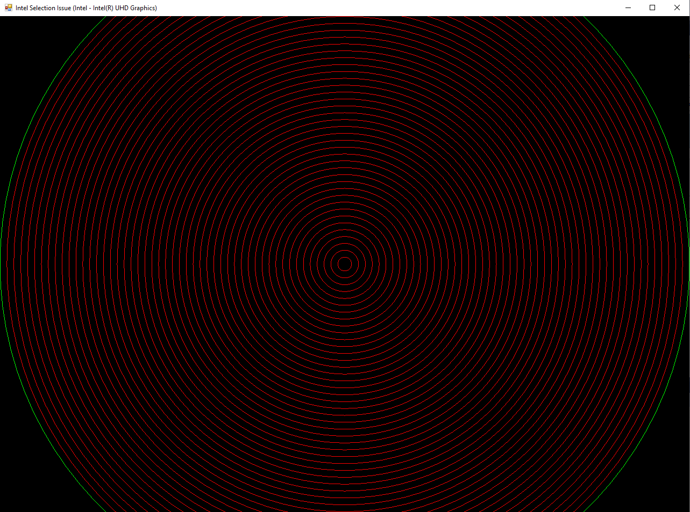
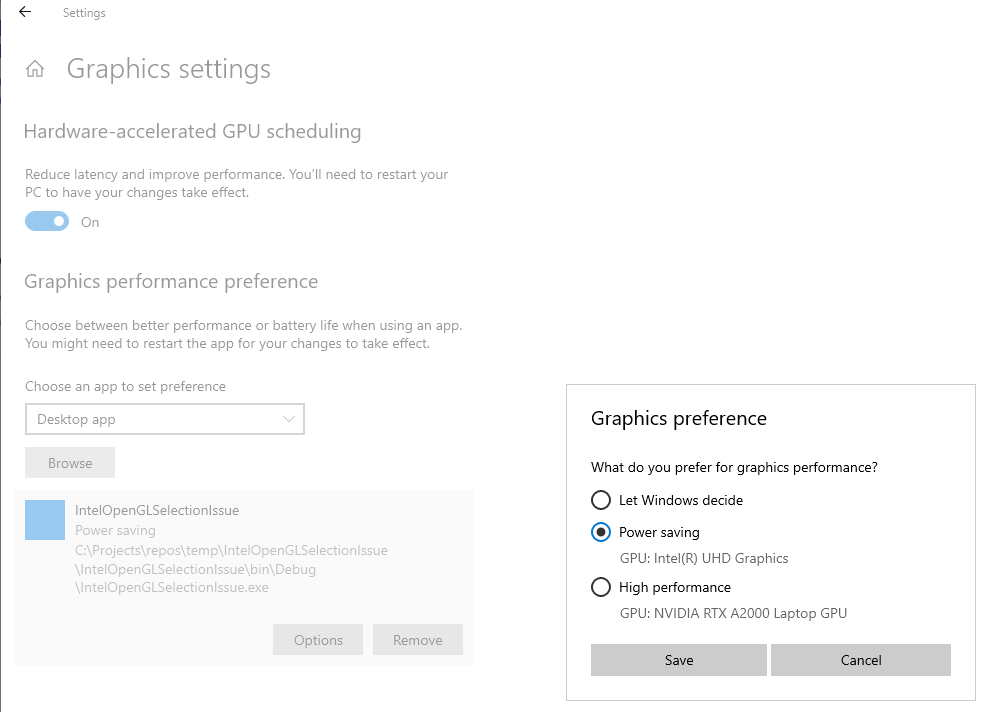

# Intel OpenGL Selection Issue
This simple test app demonstrates an issue we've encountered on Intel-based cards when using OpenGL's selection buffer for picking objects.

It's a WinForms (C#) app that uses SharpGL as its interface to OpenGL.  Although this is a wrapper around the C OpenGL calls, we believe this is
good enough to demonstrate that there is a problem here.

# Running the app
Just start the app to run it.  A series of concentric circles are drawn in red on the screen.

Use the mouse to click a circle.  If the app is behaving as designed, that circle will display in green.  Click anywhere not on a circle
to deselect it.

# Testing
Our development laptops have 2 graphics cards:
* Built-in Intel UHD Graphics
* NVIDIA RTX A2000 Laptop GPU

We are running Windows 10.

## With Intel UHD Graphics

Use the Windows 10 Graphics settings to force this test app to use the **Power saving (Intel UHD Graphics)** card, then start the app.

In our environment, no matter which circle is clicked on it always chooses the last circle.

Checking the hit-test code in `OpenGLControl1_MouseClick`, the number of hits returned equals the number of circles being rendered.  This
should only return the circle that's in the set up Pick Matrix - so only ever 1 hit (not 50).

## With other graphics cards

Switching to force this test app to use the **High performance (NVIDIA)** card, the app behaves as expected - returning 1 hit and choosing the
circle that's been clicked on.

SharpGL can also be switched to run in 'software' mode - rendering to a DIB Section. To do this, open `Form1.Designer.cs` and change
the `this.openGLControl1.RenderContextType = SharpGL.RenderContextType.NativeWindow;` line to
`this.openGLControl1.RenderContextType = SharpGL.RenderContextType.DIBSection`;

This 'software' mode also produces the expected result - the clicked on circle is selected.

